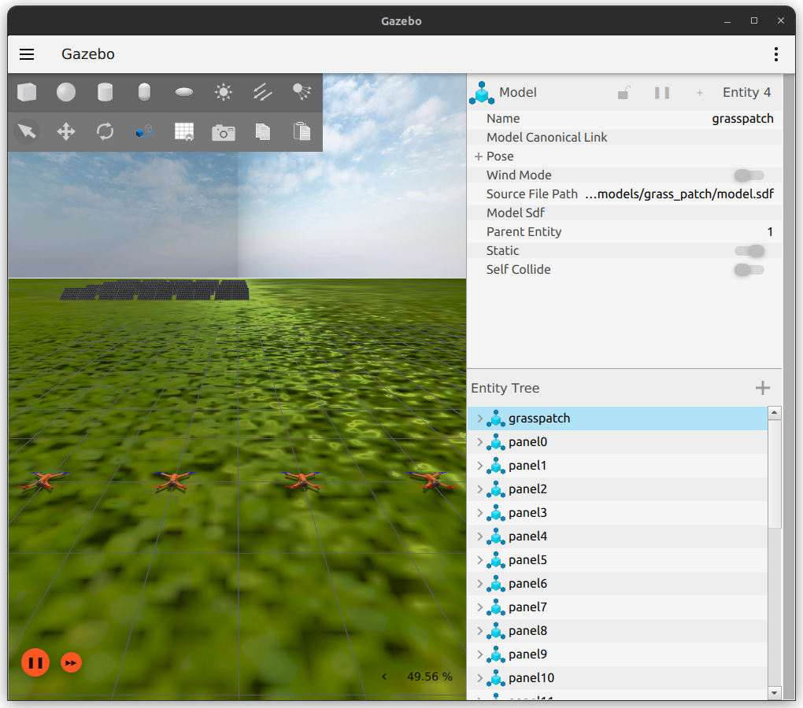

# Mission Execution Architecture for Multi-UAV Teams

## Overview
This repository contains two packages for controlling a UAV swarm, mainly for inspection tasks but scalable to other situations and aerial platforms. Both packages were created based on a previous architecture that used ROS (Robot Operating System) and the Behaviour Trees technique: https://github.com/multirobot-use/mrta_execution_architecture


This repo is kind of an update of that architecture, using ROS2 and Aerostack2, an aerial platform framework designed to ease the creation of systems and architectures like this.
It can be installed completly with:
```
cd ~/aerostack2_ws/src
git clone https://github.com/aerostack2/aerostack2
colcon build 
```
or partially with, for example:
```
cd ~/aerostack2_ws/src
git clone https://github.com/aerostack2/aerostack2/tree/main/as2_motion_controller   # or any other package
colcon build --select-packages as2_motion_controller
```
For this project you will need: ```as2_motion_controller, as2_behavior, as2_behavior_tree and as2_python_api```


If there was any problem when compiling Aerostack2 packages, try first:
```
colcon build --cmake-args -DCMAKE_BUILD_TYPE=Debug
```
If it does not work, open an Issue in its repository.


### Needed changes in Aerostack2 packages
1. In ```as2_motion_controller/plugins/pid_speed_controller/include/pid_speed_controller/pid_speed_controller.hpp```:
```
  std::string enu_frame_id_ = "earth";
  std::string flu_frame_id_ = "drone0/base_link"; // Not used if controlling in ENU frame
```

2. In ```as2_motion_controller/plugins/pid_speed_controller/pid_speed_controller.cpp```, in ```setMode()```, add the first condition of this ```if``` if not added in the latest version of the package:
```
if (in_mode.control_mode == as2_msgs::msg::ControlMode::POSITION &&
    !flags_.position_controller_parameters_read)
```

3. See the mentioned in the explanation of ```behaviour_trees_pkg``` for the last changes.


The architecture has been tested in a solar field Gazebo simulation, but feel free of modifying interfaces, the controller, etc., to adapt it to your case.

About how it works, it is a modular system divided mainly in: motion control, interfaces communication and behaviors based plan execution. This modularity let the user to test each of this part (almost) independently ("almost" because for testing higher abstraction level parts you need lower ones), using for that the ```.bash``` executables provided in ```executables```.


## Simulation
The simulation used is one created to directly use Aerostack2 interfaces. To make it work with the packages of this repository, it is advisable to name your ROS2 workspace as "aerostack2_ws".
Check its repository for more information: https://github.com/CoreSenseEU/TB2_Panel_Inspection_Simulation

Simulation can be launched, stopped and rebooted with these executables (change pathes inside these files if needed):
```
./simulation.bash
./stop.bash
./reboot_sim.bash
```

UAVs' control mode can be set with:
```
./configure_control_mode.bash
```




## Installation
```
cd ~/aerostack2_ws/src
git clone https://github.com/migueltg20/uav_swarm_mission_arch
colcon build --packages-select motion_controller_pkg behaviour_trees_pkg
```

## Packages
As mentioned, this repo contains two ROS2 packages for UAV mission execution: one for simple motion control, and one for Behaviour Trees application (the latter package uses the motion controller one as a base).


### motion_controller_pkg
This package contains 2 nodes those acts as server and client for a ROS2 action that communicates both. Client node subscribes to '''/goal''' topic and waits until a new goal for an specified UAV is given, then creates a new action client and send the action goal request to the server node.
Server node instances an action server for every UAV you have and waits for a goal request. When it receives one, it starts applying the logic to suit the goal to low-level controller interface, and after all, it publishes the twist commands for the UAV specified. Notice that as mentioned in the Overview, the controller configuration is perfectly interchangeable for another configuration (speed, position, etc.).

The nodes can be launched with:
```
./launch_motion.bash
```
For direct testing, you can modify the content of ```./goal_....bash``` files and execute them.


### behaviour_trees_pkg
This package contains the abstraction layer to perform missions without telling directly to the motion nodes what to do. There are 5 behavior action servers and clients those act following Behavior Tree manager. For the 3 motion behaviors, 3 custom actions have been defined: TakeOffBh, LandBh and FollowTrajBh.

In order to test the behavior of the behavior servers, forgive the redundancy, there are 5 Python scripts those use ```as2_python_api``` package and those act as simple action clients in order to easily test the servers and their impact in the motion nodes.

At the moment, the header files those are the clients and the Behavior Tree manager have to be moved to ```as2_behavior_tree``` to make them work because of errors that have to be fixed (the launch files are already designed to "know" this). 
```
./launch_behaviors.bash
```


### Launching everything
If you want to launch the simulation and the architecture once you have checked they perform the mission you want, use:
```
./launch_all.bash
```


## Demo
Here is a video of a demo, where 2 UAVs perfom a linear and a circular trajectories and a custom trajectory above 4 solanr panels (and the keeps the position): [Watch demo video on YouTube](https://www.youtube.com/watch?v=JUp0rhopJp8)

Or go to ```/videos/demo.mp4```
